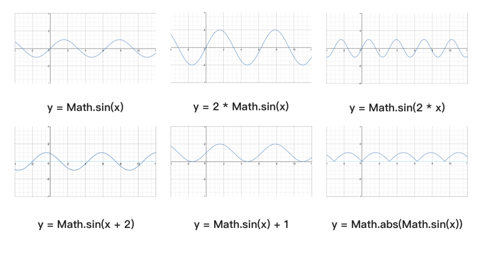

# 公式

## 获取经纬度之间的距离

```js
const distance = function (lat1, lng1, lat2, lng2) {
  const radLat1 = lat1*Math.PI / 180.0;
  const radLat2 = lat2*Math.PI / 180.0;
  const a = radLat1 - radLat2;
  const b = lng1*Math.PI / 180.0 - lng2*Math.PI / 180.0;
  let s = 2 * Math.asin(Math.sqrt(Math.pow(Math.sin(a/2),2) +
  Math.cos(radLat1)*Math.cos(radLat2)*Math.pow(Math.sin(b/2),2)));
  s = s *6378.137 ;
  s = Math.round(s * 10000) / 10000;
  return s;
}
const range = distance(39.96482, 116.473025, 40.012408, 116.512664)
range // 6.2844KM
```

## 三角函数
### 通过正弦曲线实现波浪效果

#### 勾股定理
```js
sinθ = a / h
cosθ = b / h
tanθ = a / b
```
#### 极坐标和单位圆
在笛卡尔直角坐标系中，任一点 (x, y) 都可以转化成极坐标表示 (r, θ)，其中
```js
r = Math.sqrt(x^2 + y^2)
θ = Math.atan2(y, x)
```
单位圆的定义是半径为单位长度的圆，圆上任意一点的横坐标就是对应角度的余弦值，任意点的纵坐标就是对应角度的正弦值。

#### 正弦曲线公式 <code>y = A * sin(Bx + C) + D</code>

> A 控制振幅，A 值越大，波峰和波谷越大，A 值越小，波峰和波谷越小；B 值会影响周期，B 值越大，那么周期越短，B 值越小，周期越长。C 值会影响图像左右移动，C 值为正数，图像左移，C 值为负数，图像右移。D 值控制上下移动。

exam
```js
    const canvas1 = document.getElementById('canvas_1')
    const ctx = canvas1.getContext('2d')
    const width = 400
    let step = 0.1
    function draw () {
      console.log(11)
      ctx.clearRect(0,0, canvas1.width, canvas1.height)
      const posi = []
      step +=0.1
      for (let x = 0; x <= width; x++) {
        const radians = x / width * Math.PI * 2
        const scale = (Math.sin(radians - Math.PI * 0.5) + 1) * 0.5
        // const y = Math.sin(x * 0.02 + step) * scale * 20
        const y = Math.sin(x * 0.02 + step) * 20
        posi.push([x, y])
      }
      ctx.beginPath()
      posi.forEach(item => {
        ctx.lineTo(50+item[0], 50+item[1])
      })
      ctx.strokeStyle = 'red'
      ctx.stroke()
      window.requestAnimationFrame(draw)
    }
    draw()
```

#### 纯css 实现波浪效果
通过设置元素的css属性<code>border-radius</code> <code>transform-origin</code> <code>transform-rotate</code>，展示不同的弧度片段，实现波浪效果。
```css
.sea .wave {
	position: absolute;
	top: -250px;
	left: -100px;
	width: 500px;
	height: 500px;
	background: deepskyblue;
	border-radius: 43%;
	filter: opacity(0.4);
	animation: drift linear infinite;
	transform-origin: 50% 48%;
}

@keyframes drift {
	from {
		transform: rotate(360deg);
	}
}
```